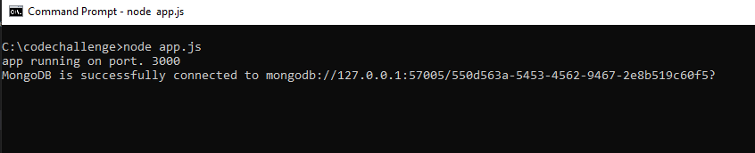
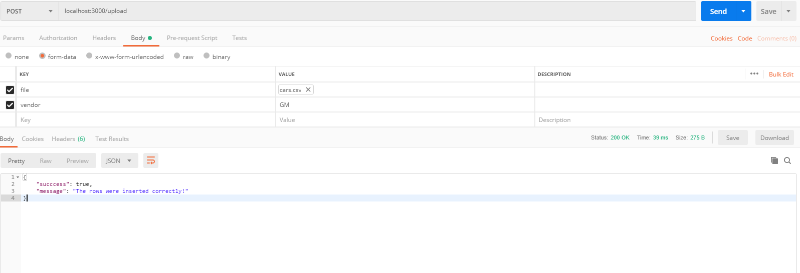
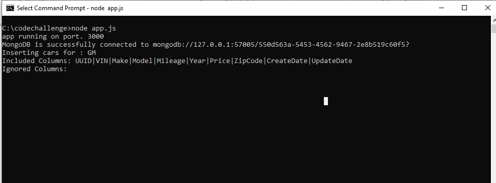
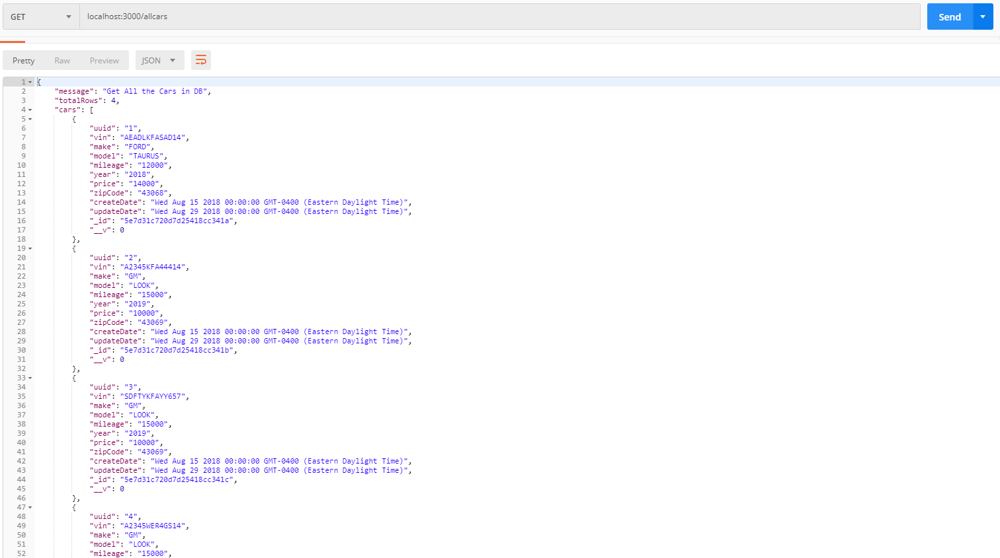

# Code Challenge for Autofi
> In this code challenge I'm providing a solution to upload a CSV file in a NO SQL database in this case Mongo DB (in memory editon).  

## Table of contents
* [General info](#general-info)
* [Multiple Providers](#multiple-roviders)
* [Screenshots](#screenshots)
* [Technologies](#technologies)
* [Setup](#setup)
* [Features](#features)
* [Status](#status)
* [Inspiration](#inspiration)
* [Contact](#contact)

## General info
I'm parting from the point that I need to store in a database that should be queried later, for that reason I'm using MongoDB memory server to avoid the task to install real Mongo server. As it is a No SQL database I need to store the information in JSON, so I need a predefined schema to organize the inserts, for that I'm using mongoose.

The way the code is orgnized is in an MVC: the View module is defined in \routes\routes.js which also is responsible to receive the CSV file, to upload the file I was primary using express-fileupload but it wasn't creating a middleware to ensure we have the file uploaded before to insert into database, for that reason I decided to change to multer library. The Controller is defined in controllers\carController.js which uses csvToJson library and the model defined in models\BECar (BE for business entity). The Model is a schema using mongoose where I set some attributes to the fields such as unique and required to ensure to not upload duplicate rows.

## Multiple Providers
To handle multipe providers with different configuration options, I'm taking advantage of the atributes that cvsToJson library enables: includeColumns and ignoreColumns, You can define throught a regular expression which fields should be included or ignored if we leave ignoreColumns as empty it assumes that there is no column to ignore.

Example:
{ 
    "GM": { 
        "includeColumns":"UUID|VIN|Make|Model|Mileage|Year|Price|ZipCode|CreateDate|UpdateDate",
        "ignoreColumns":""
    },
    "Toyota": { 
        "includeColumns":"UUID|VIN|Make|Model|Mileage|Year",
        "ignoreColumns":"Price|ZipCode|CreateDate|UpdateDate"
    }
}

To post a file, we do a POST to the endpoint and pass two parameters in body:
- file: the CSV file to be uploaded
- vendor:  provider name, could be GM, Toyota, etc, as long as we add more entries in config.json 

## Screenshots

## Technologies
* express
* bodyParser
* mongoose
* mongodb-memory-server
* multer
* csvtojson
* read-config

## Status
Project is:  _finished_
.

## Contact
Created by [@edyrecuay](https://app.codesignal.com/profile/edison, https://www.linkedin.com/in/edison-munoz-22286217/) - feel free to contact me!